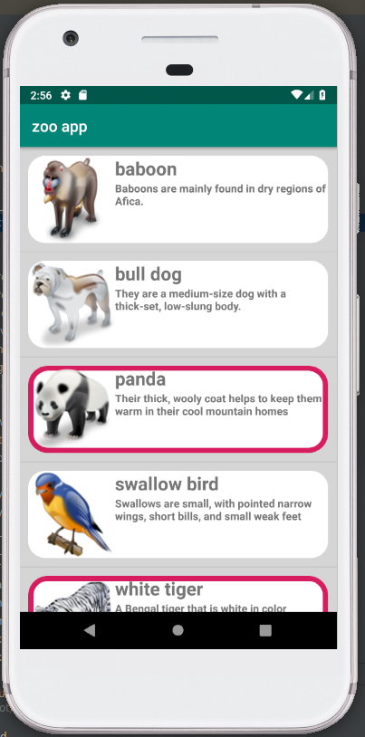
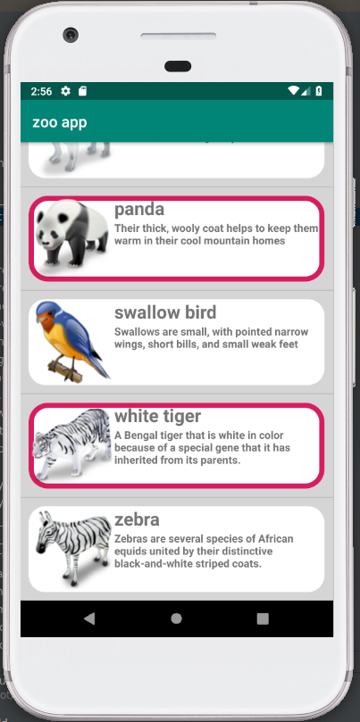
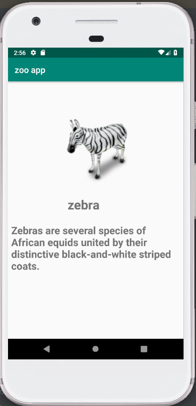
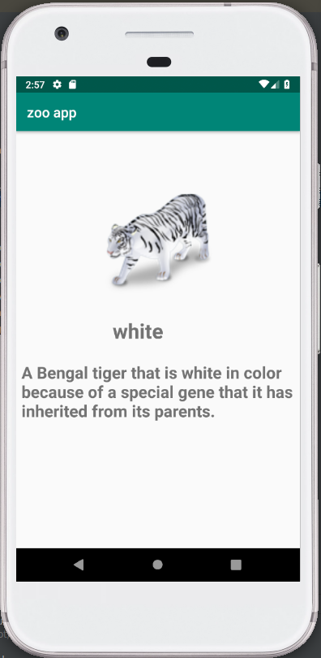
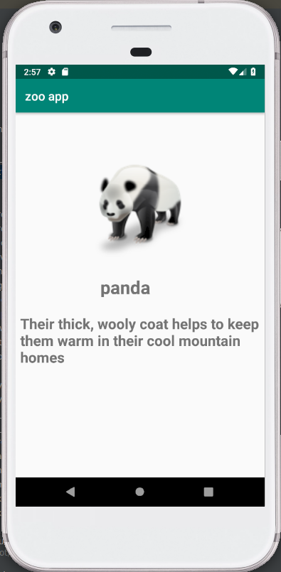

# Animal Encyclopedia 
## A simple Android frotend UI whiich gives brief info about some animals.
### That's how it looks  ->

### After Scolling further.   ->

### Opened another activity after clicking on image.   ->

### Example   ->

### One more example   ->

<pre>
*********************************************** END *************************************************
</pre>
